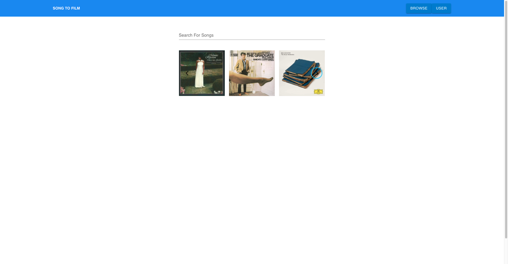
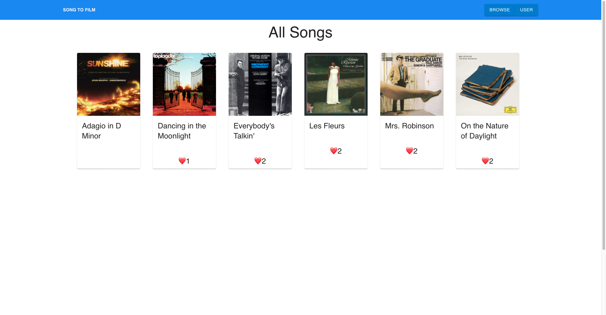
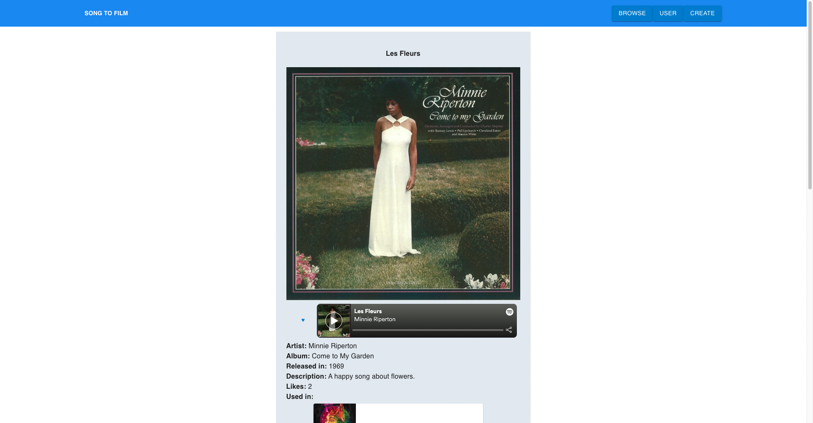
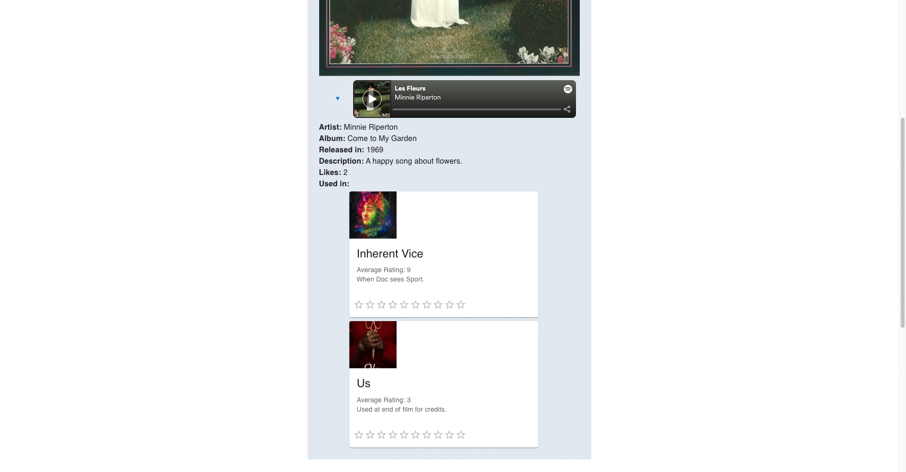
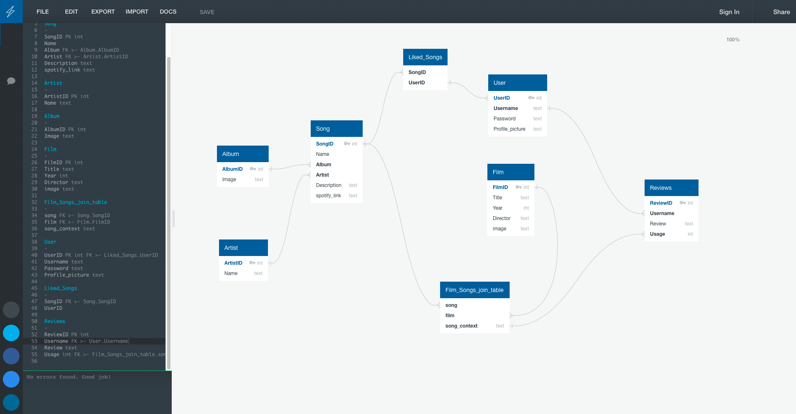

# Song to Film API

GA SEI Project 4 API

# The Brief

Build a full-stack application by making your own backend and your own frontend
Use a Python Django API using Django REST Framework to serve your data from a Postgres database
Consume your API with a separate front-end built with React
Be a complete product which most likely means multiple relationships and CRUD functionality for at least a couple of models
Implement thoughtful user stories/wireframes that are significant enough to help you know which features are core MVP and which you can cut.
Have an entity relationship diagram showing your proposed database schema.
Have a visually impressive design.
Be deployed online so it's publicly accessible.

## Site Overview

Song to Film is a website dedicated to discovering song usage in films, users can search for songs to see how many films they have appeared in and how they are used. The site also allows for users to submit songs and films to be added to the database so that the data can grow from user input. The user can also save liked songs and rate the usage of songs in films.

<p align="center">


</p>
 
<p align="center">


</p>
 
## Technologies Used:
 
- Backend: Django
- Front End: React
 - Packages: axios for API handling
- Styling: Tailwind, Material UI
- Version Control: Git
- Deployment: Netlify (FE), Heroku (BE)
 
## General Approach:
 
### Day 1/2: Planning
 
Used Excalidraw to plan the frontend of the app, and quickdatabasediagrams for the ERD. The MVP requirements were set, and many stretch goals identified.
 
### Day 2/3: Backend
 
This process was mainly straightforward, using Postman to test the API calls. The main focus was the structure of the database and how the usage of the songs would fit into it. This was enabled by using a through table, allowing for the usage to exist only on the joins of the song and film tables.
```python
class Song (models.Model):
 name = models.CharField(max_length=200)
 films = models.ManyToManyField(Film, related_name='songs', through='Context', blank=True)
 album = models.ForeignKey(Album, related_name='songs', max_length=100, on_delete=models.CASCADE)
 artist = models.ForeignKey(Artist, related_name='songs', max_length=50, on_delete=models.CASCADE)
 year = models.IntegerField()
 description = models.CharField(max_length=300)
 spotify_link = models.CharField(max_length=200)
 def __str__(self):
   return self.name
 
class Context (models.Model):
 song = models.ForeignKey(Song, on_delete=models.CASCADE)
 film = models.ForeignKey(Film, on_delete=models.CASCADE)
 usage = models.CharField(max_length=300)
 def __str__(self):
   return f"{self.song} used in {self.film}"
```
For the views, I decided to use class based views so that I could have more control over the functions, and this felt more familiar to me as the process is similar to writing controllers in JavaScript when using MongoDB. My main struggle at this point was writing a view that would retrieve all the contexts for a given song, but by using filter I was able to accomplish this. 
```python
class ContextRetrieveAllForSong(APIView):
 
   def get(self, request):
 
     songId = request.GET.get('songId')
      
     context = list(Context.objects.filter(song=songId))
 
     serialized_context = PopulatedContextSerializer(context, many=True)
 
     return Response(data=serialized_context.data, status=status.HTTP_200_OK)
 
```
### Day 4-6: Frontend
 
Some time was devoted to making sure the frontend and backend would speak to each other. Once I had basic functionality, i.e. being able to GET songs and films, I decided to start with the simpler pages such as login and signup. These pages were developed to an MVP standard, essentially just to the point that I had forms that worked, as some of my stretch goals included refining these pages and giving the user more feedback on their input errors. This part took longer than I had anticipated as I wanted to push myself to learn a new CSS library, Tailwind. I also wanted to use Material UI for components that would seem more polished. Learning to use these new technologies slowed me down somewhat. One major hangup I had which was unexpected was that the like button would have to work differently than how I had gotten it to work in my previous project. I did manage to solve it, but the solution doesn’t quite seem satisfying. I decided to not use state as it caused errors trying this approach, so this was the logic instead:
``javascript
{userData && (
             <Button size="small" color="primary" onClick={handleLikeButton}>
               {song.liked_by.filter(
                 (item) => item.username === userData.username
               ).length > 0
                 ? '♥'
                 : '♡'}
             </Button>
           )}
 
```
I was however, pleased to figure out how to display the contexts for each song, 
```javascript
{songContexts
                         ?.filter((item) => item.film.id === film.id)
 
                         .map((context) => (
                           <>
                             <Typography
                               key={context.id}
                               variant="body2"
                               color="text.secondary"
                             >
                               Average Rating: {averageRating(context)}
                               <br />
                               {context.usage}
                             </Typography>
                           </>
                         ))}
 
```
as I was able to use a combination of a map and filter to display the information I wanted to. 
### Day 7: Bug Fixes/Stretch Goals
 
I was delayed by my struggle with some of the frontend functions, so I decided to add a few more of my stretch goals. The main difficulty was to implement a rating system on the song usages, which due to the nature of the data was a bit more difficult than expected. Due to the time constraints, the rating system is only partially finished, as it now only creates a rating when clicked, but the user has no ability to edit or remove their rating on the frontend. If I had more time, I would seek to refine this feature.
 
### Wireframes:
 
<p align="center">


</p>
 
## Major Hurdles
 
An initial struggle was configuring the database to accommodate descriptions for the song's context or usage in a certain film. The solution was to use django's 'through' method on the many to many relationship, and a new model named Context, which allows for information to be stored that is relevant to the join table of song and film.
 
I found it challenging to implement what I thought would be simple enough features such as a like button and reviews for the song contexts. Given the structure of the database, it proved to be more difficult to access user specific data for each context and render certain components based off of that info in React. I managed to figure it out, but the solution seems quite messy and it ate up a lot of project time.
 
I also used the tailwind css library for the first time, so it was a challenge to get acquainted with it.
 
## Wins
 
My main satisfaction with this project was the backend. I was very happy with the structure of the database, and especially the use of a through table that allowed for the commenting on the joins between film and songs. This was an aspect that I knew was going to be complicated and I am happy that I got it working how I wanted it to. 
 
## Bugs
The rating portion of the usages is not fully fleshed out, at the moment users can create a rating, but once they create it, they can’t change their first rating or delete it.
 
## Future Improvements  
 
There are a lot of improvements that I would want to make in order to make it feel like a fully formed website. Due to time constraints I didn’t finish many of my stretch goals, such as a more fleshed out user page, artist pages, and a much more intuitive form for adding a song to the database. I also think I could improve the styling of the website to give it a more modern feel. I would also want to fix the rating system on the usages, adding logic so that if the user has already rated a usage, clicking the rating again edits the user’s previous rating to reflect the new rating.  
 
## Key Learnings
 
I think a key point I took away from this project was that I should really focus on the scope of future projects and the time I have to do them. I found with this project that as I was working through it, I kept thinking of stretch goals and more features to give the app more functionality. As a result, I feel that I spent less time on styling and refining the existing features, and I feel this impacted the quality of the final site. 
 
I learned a lot about how useful Django is out of the box, I really appreciated the amount of admin features that Django comes with, this allowed me to focus on other features for the site, which was needed. 
 
I learned a lot about using a PostgresQL database, and found that I preferred it to a document based database which was what I had experienced before. I really enjoyed working out the structure of this database, thinking of what information I wanted to be available and how it intersects with other tables.  
 
### Contact Me
Email: JDeering94@gmail.com

LinkedIn: https://www.linkedin.com/in/joe-deering/

Portfolio: joedeering.co.uk

Feel free to share feedback or if you are aware of any job opportunities please let me know.
