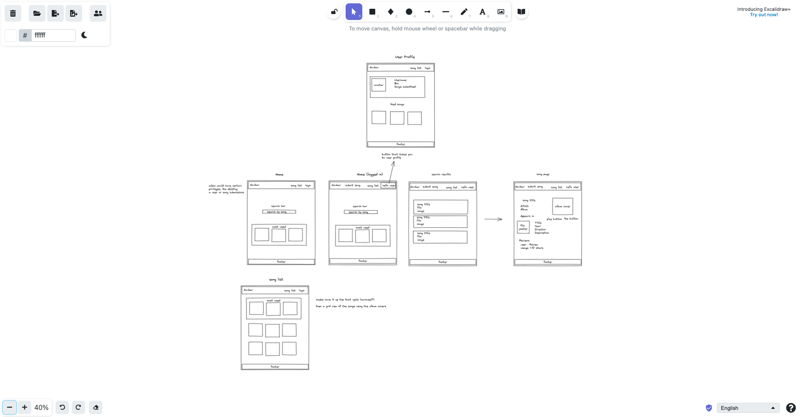

# ga-project-4-api

Backend for the 4th project

## Site Overview

Song to Film is a webiste dedicated to discovering song usage in films, users can search for songs to see how many films they have appeared in and how they are used. The site also allows for users to submit songs and films to be added to the database so that the data can grow from user input. The user can also save liked songs and rate the usage of songs in films.

## Technologies Used:

- Backend: Django
- Front End: React
  - Packages: axios for API handling
- Styling: Tailwind, Material UI
- Version Control: Git
- Deployment: Netlify (FE), Heroku (BE)

## General Approach:

### Day 1/2: Planning

Used excalidraw to plan the frontend of the app, and quickdatabasediagrams for the ERD. The MVP requirements were set, and many stretch goals identified.

### Day 2/3: Backend

This process was mainly straightforward, using postman to test the API calls. The main focus was the structure of the database and how the usage of the songs would fit into it. This was enabled by using a through table, allowing for the usage to exist only on the joins of the song and film tables.

### Day 4-6: Frontend

Some time was devoted to making sure the frontend and backend would speak to each other. Once I had basic functionality, i.e. being able to GET songs and films, I decided to start with the simpler pages such as login and signup. These pages were developed to an MVP standard, as some of my stretch goals included refining these pages and giving the use more feedback.

### Day 7: Bug Fixes/Stretch Goals

### Wireframes:

## Major Hurdles

An initial struggle was configuring the database to accomodate descriptions for the song's context or usage in a certain film. The solution was to use django's 'through' method on the many to many relationship, and a new model named Context, which allows for information to be stored that is relevant to the join table of song and film.

I found it challenging to implement what I thought would be simple enough features such as a like button and reviews for the song contexts. Given the structure of the database, it proved to be more difficult to access user specific data for each context and render certain components based off of that info in React. I managed to figure it out, but the solution seems quite messy and it ate up a lot of project time.

I also used the tailwind css library for the first time, so it was a challenge to get acquainted with it.
